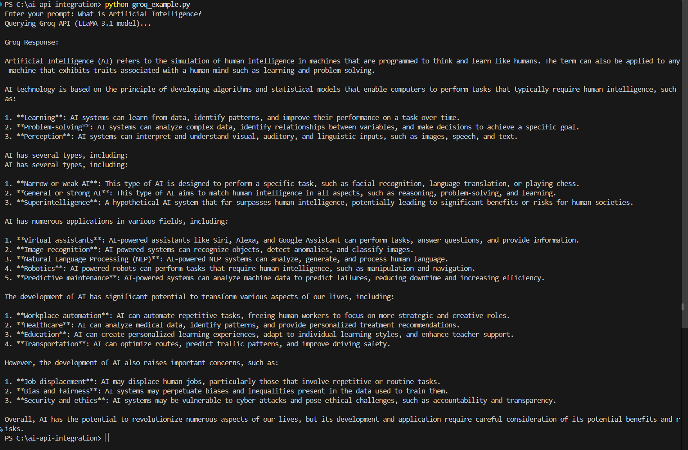
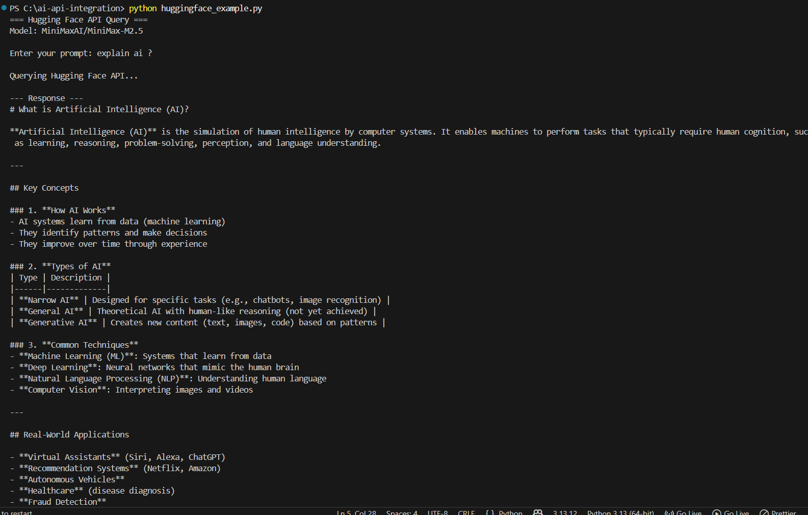
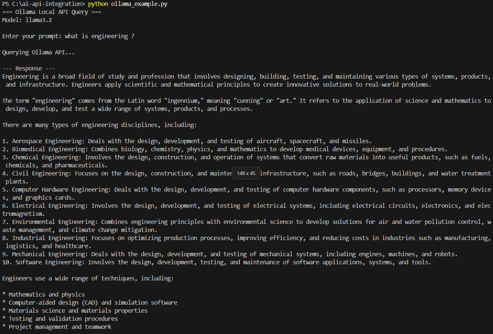
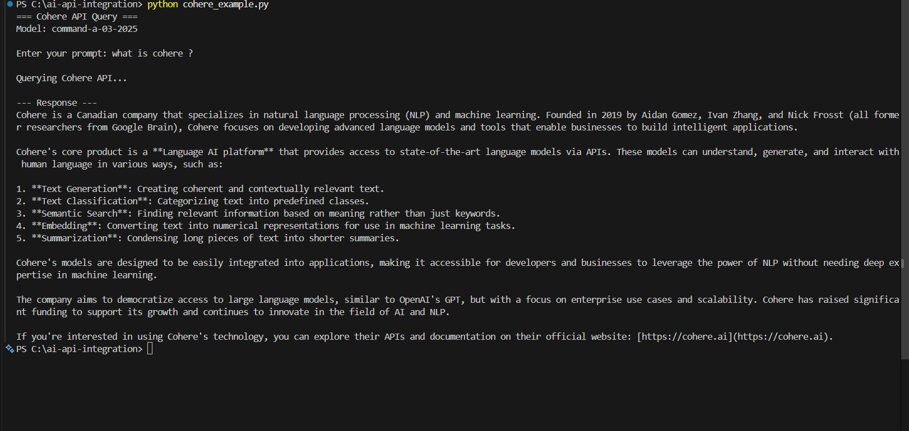
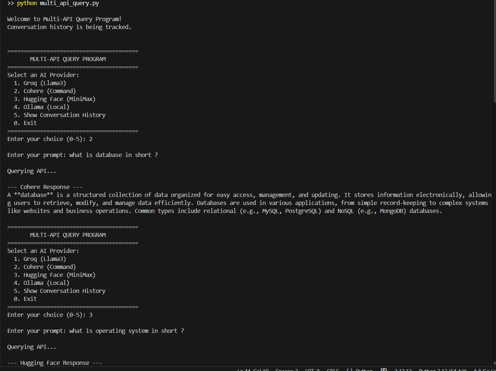
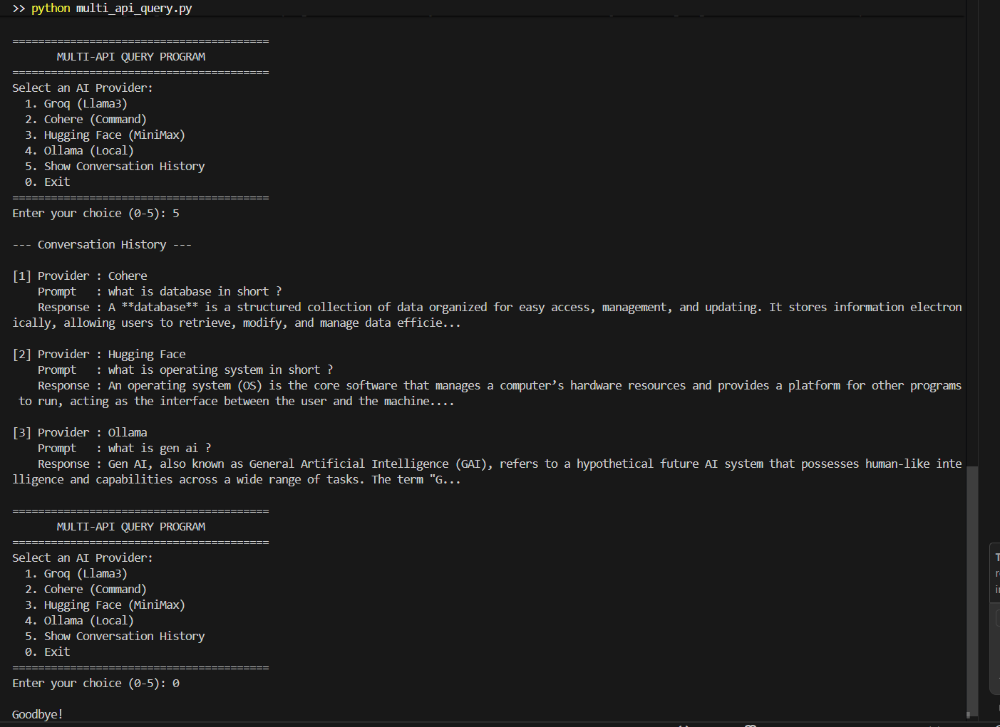

# AI API Integration

This is my assignment project for the Generative AI course at CampusPe.
In this project I have connected Python programs to different AI APIs and
tested them by sending prompts and getting responses back.

## What I Built

I created separate Python programs for each AI provider and also a combined
program where you can choose which AI you want to talk to.

## APIs I Used

- **Groq** - Fast inference using Llama3 model
- **Hugging Face** - Used MiniMax model through their router API
- **Ollama** - Runs a local AI model on my own machine (no internet needed)
- **Cohere** - Used Command model for text generation

## Screenshots

### Groq Output



### Hugging Face Output



### Ollama Output



### Cohere Output



### Multi API Output



### Conversation History Feature



## Folder Structure

```
ai-api-integration/
├── screenshots/
│   ├── cohere_screenshot.png
│   ├── groq_screenshot.png
│   ├── history_feature.png
│   ├── hugging_face_screenshot.png
│   ├── multi_api_screenshot.png
│   ├── multi_api.png
│   └── ollama_screenshot.png
├── cohere_example.py
├── gemini_example.py
├── groq_example.py
├── huggingface_example.py
├── multi_api_query.py
├── ollama_example.py
└── requirements.txt
```

## How to Set This Up

### Install the required libraries

```
pip install -r requirements.txt
```

### Getting API Keys

For **Groq** go to https://console.groq.com and sign up for free.
After signing in go to API Keys section and create a new key.

For **Hugging Face** go to https://huggingface.co and create an account.
Then go to Settings → Access Tokens and generate a new token.

For **Cohere** go to https://dashboard.cohere.com and sign up.
Your API key will be on the dashboard homepage.

For **Ollama** there is no API key needed. Just download and install it
from https://ollama.ai and run it in the background.

### Setting Environment Variables

On Windows PowerShell run these before running any program:

```
$env:GROQ_API_KEY="your-groq-key-here"
$env:COHERE_API_KEY="your-cohere-key-here"
$env:HUGGINGFACE_API_KEY="your-huggingface-key-here"
```

I kept all API keys in environment variables and never wrote them
directly in the code files for security reasons.

## Running the Programs

### Groq

```
python groq_example.py
```

### Hugging Face

```
python huggingface_example.py
```

### Ollama

Make sure Ollama app is running in background first, then:

```
python ollama_example.py
```

### Cohere

```
python cohere_example.py
```

### Multi API Program

This is the bonus program where you can pick any AI from a menu:

```
python multi_api_query.py
```

## Bonus Features I Added

**Multi-API Query Program** - Instead of running separate files I made
one unified program with a menu. You just pick a number and enter your
prompt and it sends it to whichever AI you selected.

**Error Retry with Backoff** - If an API call fails due to network issues
or rate limits, the program automatically waits and tries again instead
of just crashing. It tries 3 times with increasing wait times (2s, 4s, 8s).

**Conversation History** - The multi API program keeps track of all your
previous questions and responses in the same session. You can view the
full history by selecting option 5 from the menu.

## Notes

- Ollama runs completely offline on your local machine
- Hugging Face free tier sometimes takes time to respond as models
  need to load
- All programs have proper error handling so they won't crash if
  something goes wrong
